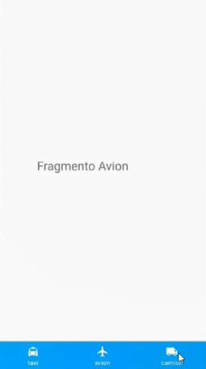

# Talento Digital Android 2021-07-26 (Lun) Módulo 4 - Clase 05
Día 1, semana 14

## Reflexión

El módulo 4 con el primer profesor fue un caos, y sólo vimos una pequeña parte de los contenidos que se debería haber cubierto.

Hoy estudiamos el uso de fragments con BottomNavigationBar

