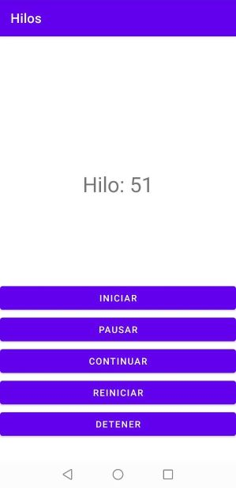

Actividades del día 2, semana 14.

(Clase 6: martes 27 de julio de 2021)

---

Hoy estudiamos el uso de hilos en una aplicación. Hasta ahora habíamos trabajado con 1 sólo hilo, lo que significa que la aplicación sólo podía hacer 1 cosa a la vez. Al agregar más hilos, la aplicación puede hacer más de 1 cosa a la vez.

---

### Ejercicio: Crear  una aplicación que genere un segundo hilo para incrementar un contador mientras el hilo principal se encarga de seguir manejando la interfaz.



```Kotlin

package com.example.hilos

import androidx.appcompat.app.AppCompatActivity
import android.os.Bundle
import kotlinx.android.synthetic.main.activity_main.*

class MainActivity : AppCompatActivity() {

    var contador = 0
    var estado = true
    var pausa = false

    override fun onCreate(savedInstanceState: Bundle?) {

        var hilo=Hilo(this)

        super.onCreate(savedInstanceState)
        setContentView(R.layout.activity_main)

        bt_iniciar.setOnClickListener {
                    hilo.start()
        }

        bt_pausar.setOnClickListener {
            pausa = true
        }

        bt_continuar.setOnClickListener {
            pausa = false
        }

        bt_reiniciar.setOnClickListener {
            contador = 0
        }

        bt_detener.setOnClickListener {
            if(hilo.isAlive) {
                estado = false
                return@setOnClickListener
            }
        }
    }


    class Hilo(activity:MainActivity):Thread() {
        var act = activity
        override fun run() {
            super.run()
            while (act.estado) {
                while (act.pausa == true) {
                    sleep(100)
                }
                sleep(100)
                act.runOnUiThread {
                    act.tv_contador.setText("Hilo: " + act.contador)
                }
                act.contador++
            }
        }
    }
}
```