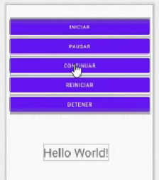

# Evidencia semana 14

**Reflexión:**
Ésta fue la última semana de clases que tuvimos con el primer profesor. Ya deberíamos estar terminando el módulo 4, sin embargo no hemos visto más que una pequeña parte de los contenidos que deberíamos haber cubierto. Al finalizar la semana, el profesor abandonó el curso sin darnos ningún aviso.

---

Esta semana estudiamos:

### Uso de fragments con BottomNavigationBar.

Ejemplo básico: aplicación que permite desplazarnos entre 3 fragments usando una barra de navegación inferior.


### Uso de hilos.

Ejemplo de una aplicación que permite activar un contador que se mantiene aumentando de valor hasta que se detenga presionando un botón. El usar un hilo separado para el contador permite que este funcione sin que bloquee la interfaz, por lo que se puede seguir presionando otros botones mientras el contador está corriendo.


```Java
package com.example.hilos

import androidx.appcompat.app.AppCompatActivity
import android.os.Bundle
import kotlinx.android.synthetic.main.activity_main.*

class MainActivity : AppCompatActivity() {

    var contador = 0
    var estado = true
    var pausa = false

    override fun onCreate(savedInstanceState: Bundle?) {

        var hilo=Hilo(this)

        super.onCreate(savedInstanceState)
        setContentView(R.layout.activity_main)

        bt_iniciar.setOnClickListener {
                    hilo.start()
        }

        bt_pausar.setOnClickListener {
            pausa = true
        }

        bt_continuar.setOnClickListener {
            pausa = false
        }

        bt_reiniciar.setOnClickListener {
            contador = 0
        }

        bt_detener.setOnClickListener {
            if(hilo.isAlive) {
                estado = false
                return@setOnClickListener
            }
        }
    }


    class Hilo(activity:MainActivity):Thread() {
        var act = activity
        override fun run() {
            super.run()
            while (act.estado) {
                while (act.pausa == true) {
                    sleep(100)
                }
                sleep(100)
                act.runOnUiThread {
                    act.tv_contador.setText("Hilo: " + act.contador)
                }
                act.contador++
            }
        }
    }
}
```