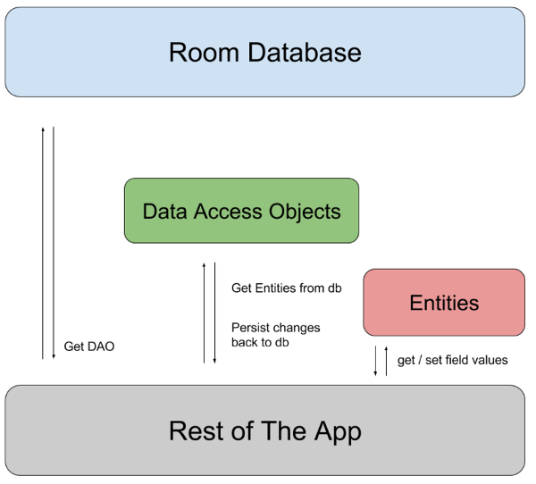

# Evidencia semana 15

**Reflexión:**
Ya se acabó el repaso de los contenidos que no habían sido cubiertos apropiadamente cuando correspondía en primera instancia, y esta semana comenzamos a ver materia nueva con el tercer profesor. Esta semana vimos una gran cantidad de información nueva y compleja.

---

Esta semana estudiamos el uso en Kotlin de las siguientes herramientas:

### Acceso a base de datos local usando Room.

La librería Room genera una capa de abstracción entre la aplicación y la base de datos en SQLite. Esto permite simplificar enormemente la programación del acceso a los datos almacenados en la base de datos, entre otras ventajas.

Al trabajar con Room se usa 3 tipos de clases o interfaces:

#### Base de datos

Clase abstracta que define la base de datos y las entidades que incluirá.

#### Entidad

Cada entidad es una clase que se corresponde con una tabla de la base de datos.

#### DAO

**D**ata **A**ccess **O**bject = objedo de acceso a datos.

Cada DAO es una clase abstracta o interfaz que define las funciones que se utilizarán para acceder a la base de datos.

### Acceso a APIs REST usando Retrofit.

Retrofit es una librería que permite interactuar con fuentes de datos externas a través de http. Dentro del contexto de este curso, sólo la usamos para cargar datos hacia nuestras aplicaciones.

### Uso de hilos y corrutinas.

Debido a que el acceso a datos ya sea desde una base de datos interna con Room o desde una API REST con Retrofit consumen recursos y tiempo considerable, usamos corrutinas para que estas actividades no bloqueen la aplicación.

### Carga de imágenes en pantalla usando librerías como Picasso o Glide.

Usamos estas librerías para poder cargar imágenes a partir de direcciones url obtenidas desde una API REST con Retrofit, y mostrarlas en nuestras aplicaciones.