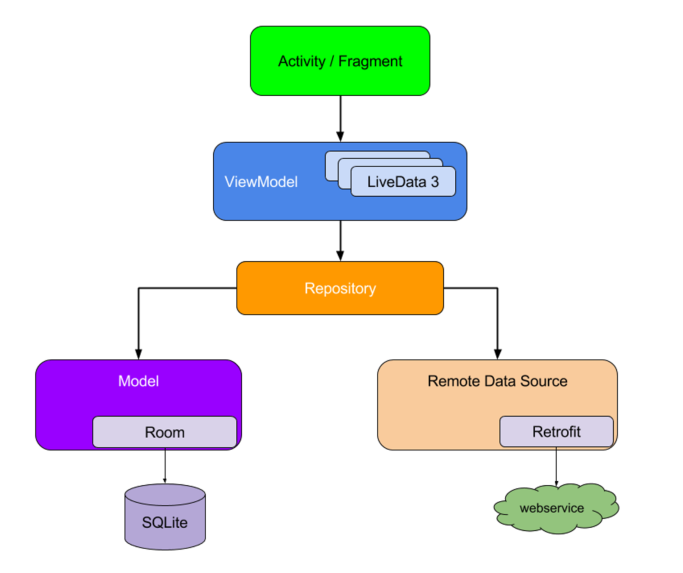

# Evidencia semana 16

**Reflexión:**

Las últimas semanas han sido una avalancha sobre otra avalancha. Principalmente vimos varios ejercicios con Retrofit, Room y LiveData, y vimos algunos otros temas como tests unitarios y de integración. Tanto ejercicio terminó confundiéndome más servir para aclarar o reforzar lo estudiado.

---

# Repaso Retrofit + Room + MVVM + RV: Aplicación con razas y fotos de perros.



## 🗨️ Podemos empezar tanto por el lado de la API (Retrofit) o de la base de datos local (Room). Los modelos no van a ser necesariamente iguales.

## 🔴 API ([[#Retrofit]])

### 🧩 (Modelo) MascotaJson.kt: Modelo generado desde la API.


#### ⭐ Podemos eliminar los atributos que no necesitemos.

```Kotlin
package com.example.repaso.model

data class MascotaJson(
    val message: List<String>
	// val status: String
)
```


### 🧩 (Modelo) RazaJson.kt: Modelo generado desde la API.

```Kotlin
package com.example.repaso.model

data class RazaJson(
    val message: List<String>
)
```


### 🧩 (Service) MascotaService.kt: manejo de endpoints.

Equivalente al DAO de Room.

Define los endpoints que serán usados, las consultas que activarán y el tipo que retornarán.

```Kotlin
package com.example.repaso.service

import com.example.repaso.model.MascotaJson
import com.example.repaso.model.RazaJson
import retrofit2.Call
import retrofit2.http.GET
import retrofit2.http.Path

interface MascotaService {

    @GET("breed/{raza}/images")
    fun getMascotas(@Path("raza")raza:String): Call<MascotaJson>

    @GET("breeds/list")
    fun getRazas(): Call<RazaJson>
}
```

### 🧩 (Client) MascotaCliente.kt: 

```Kotlin
package com.example.repaso.cliente

import com.example.repaso.service.MascotaService
import retrofit2.Retrofit
import retrofit2.converter.gson.GsonConverterFactory

class MascotaCliente {

    companion object{
        const val URL_BASE  = "https://dog.ceo/api/"

        fun getCliente(url:String): MascotaService
        {
            val retrofit = Retrofit.Builder().baseUrl(url).addConverterFactory(GsonConverterFactory.create()).build()
            return retrofit.create(MascotaService::class.java)
        }
    }
}
```

## 🔴 Base de datos local

### 🧩 (Modelo) RazaModel.kt: 

#### ⭐ Primary key **no** será autogenerada.

```Kotlin
package com.example.repaso.model

import androidx.room.Entity
import androidx.room.PrimaryKey

@Entity(tableName = "raza")
class RazaModel(id:Int,var descripcion:String) {

    @PrimaryKey(autoGenerate = false)
    var id:Int = id
}
```


### 🧩 FavoritoModel.kt: Almacenar url de fotos favoritas.

#### ⭐Aquí la primary key **sí** es autogenerada.

```Kotlin
package com.example.repaso.model

import androidx.room.Entity
import androidx.room.PrimaryKey

@Entity(tableName = "favorito")
class FavoritoModel(var foto:String) {

    @PrimaryKey(autoGenerate = true)
    var id:Int = 0
}
```


### 🧩 RazaDao.kt: agregar 1 raza, todas las razas, o listar todas las razas.

```Kotlin
package com.example.repaso.dao

import androidx.lifecycle.LiveData
import androidx.room.Dao
import androidx.room.Insert
import androidx.room.OnConflictStrategy.REPLACE
import androidx.room.Query
import com.example.repaso.model.RazaModel

@Dao
interface RazaDao {

    @Insert(onConflict = REPLACE)
    fun agregar(razaModel: RazaModel)

    @Insert(onConflict = REPLACE)
    fun agregarAll(razas: List<RazaModel>)

    @Query("select id,descripcion from raza")
    fun listar() : LiveData<List<RazaModel>>

}
```

### 🧩FavoritoDao.kt: agregar o eliminar 1 favorito, listar todos los favoritos.

```Kotlin
package com.example.repaso.dao

import androidx.lifecycle.LiveData
import androidx.room.Dao
import androidx.room.Delete
import androidx.room.Insert
import androidx.room.Query
import com.example.repaso.model.FavoritoModel

@Dao
interface FavoritoDao {

    @Insert
    fun agregar(favoritoModel: FavoritoModel)

    @Delete
    fun eliminar(favoritoModel: FavoritoModel)

    @Query("select id, foto from favorito")
    fun listar(): LiveData<List<FavoritoModel>>
}
```


### 🧩 ProyectoDatabase.kt

```Kotlin
package com.example.repaso.room

import android.content.Context
import androidx.room.Database
import androidx.room.Room
import androidx.room.RoomDatabase
import com.example.repaso.dao.FavoritoDao
import com.example.repaso.dao.RazaDao
import com.example.repaso.model.FavoritoModel
import com.example.repaso.model.RazaModel

@Database(entities = [RazaModel::class, FavoritoModel::class], version = 1)
abstract class ProyectoDatabase: RoomDatabase() {

    abstract fun razaDao() : RazaDao
    abstract fun favoritoDao(): FavoritoDao

    companion object{
        @Volatile
        private var instance : ProyectoDatabase? = null

        fun getDatabase(context:Context): ProyectoDatabase
        {
            if(instance == null)
            {
                synchronized(this)
                {
                    instance = Room.databaseBuilder(context,ProyectoDatabase::class.java,"proyecto_db").build()
                }
            }
            return instance!!
        }
    }

}
```

### 🧩 Repository.kt: Manejo de datos, incluyendo el pasar datos desde la API a la base de datos local.

Las funciones en este repository podrían dividirse en 3 repository distintos para mayor orden, o juntarse todas como en un sólo repository, como es en este ejemplo.

```Kotlin
package com.example.repaso.repository

import android.content.Context
import android.util.Log
import androidx.lifecycle.LiveData
import androidx.lifecycle.MutableLiveData
import com.example.repaso.cliente.MascotaCliente
import com.example.repaso.model.FavoritoModel
import com.example.repaso.model.MascotaJson
import com.example.repaso.model.RazaJson
import com.example.repaso.model.RazaModel
import com.example.repaso.room.ProyectoDatabase
import kotlinx.coroutines.CoroutineScope
import kotlinx.coroutines.Dispatchers.IO
import kotlinx.coroutines.launch
import retrofit2.Call
import retrofit2.Callback
import retrofit2.Response
```

#### ⭐ Declaramos objetos para la base de datos, la api y LiveData.

Las funciones del DAO son llamadas a través de el objeto que contiene la base de datos.
```Kotlin
class Repository(var context: Context) {

    private val db = ProyectoDatabase.getDatabase(context)
    private val service = MascotaCliente.getCliente(MascotaCliente.URL_BASE)
    var images = MutableLiveData<MascotaJson>()
```

#### ⭐ `callRazas()`: Obtener listado de razas desde la api y guardarlo en la base de datos local. Se usa una función creada para hacer la conversión necesaria.

Los datos (en este caso, las razas) serán cargados desde la API y luego guardados en la base de datos, pero ambos modelos no son idénticos, por lo que se debe realizar una conversión. 

A partir de una lista de `String` que contiene nombres de razas de perros se debe generar una lista de objetos `RazaModel`, donde cada objeto corresponde a una raza. Para esto, se debe hacer una conversión, que será llevada a cabo por la función `convertidorRazas(razaJson: RazaJson) : List<RazaModel>`: Recibir `List<String>` desde la API y generar `List<RazaModel>`.]].

```Kotlin	
    fun callRazas()
    {
        val call = service.getRazas()
        call.enqueue(object : Callback<RazaJson>{
            override fun onResponse(call: Call<RazaJson>, response: Response<RazaJson>) {
                response.body().let {
                    var razaJson = it
                    Log.d("RAZAS",it?.message.toString())
                    CoroutineScope(IO).launch {
                        db.razaDao().agregarAll(convertidorRazas(razaJson!!))
                    }
                }
            }

            override fun onFailure(call: Call<RazaJson>, t: Throwable) {
                call.cancel()
            }
        })
    }
```

#### ⭐	`callImagenes(raza:String)`: cargar lista de imágenes desde la API y pasarlas a un MutableLiveData.
```Kotlin	
    fun callImagenes(raza:String)
    {
        val call = service.getMascotas(raza)
        call.enqueue(object : Callback<MascotaJson>{
            override fun onResponse(call: Call<MascotaJson>, response: Response<MascotaJson>) {
                response.body().let {
                    var mascotaJson = it
                    images.postValue(it)
                }
            }

            override fun onFailure(call: Call<MascotaJson>, t: Throwable) {
                call.cancel()
            }

        })
    }
```

#### ⭐	`listarRazas():`: Cargar listado de razas desde la base de datos local.
```Kotlin	
    fun listarRazas() : LiveData<List<RazaModel>>
    {
        return db.razaDao().listar()
    }
```


#### ⭐ Funciones relacionadas a las imágenes favoritas, que pertenecen a la base de datos local.
```Kotlin	
    fun agregarFavorito(favoritoModel: FavoritoModel)
    {
        CoroutineScope(IO).launch {
            db.favoritoDao().agregar(favoritoModel)
        }
    }

    fun eliminarFavorito(favoritoModel: FavoritoModel)
    {
        CoroutineScope(IO).launch {
            db.favoritoDao().eliminar(favoritoModel)
        }
    }

    fun listarFavorito() : LiveData<List<FavoritoModel>>
    {
        return db.favoritoDao().listar()
    }
```
	
#### ⭐⭐⭐ `convertidorRazas(razaJson: RazaJson) : List<RazaModel>`: Recibir `List<String>` desde la API y generar `List<RazaModel>`.

- Función llamada desde `callRazas()`: Obtener listado de razas desde la api y guardarlo en la base de datos local. Se usa una función creada para hacer la conversión necesaria.]]

Realizar la conversión necesaria para poder recibir datos desde la API y almacenarlos en la base de datos local.

- Modelo que entrega la **API**: objeto de tipo `RazaJson`, que contiene un atributo `val message: List<String>`, donde cada `String` es un nombre de raza de perro.

- Modelo que recibe la base de datos **local**: objeto de tipo `RazaModel` que contiene un atributo `descripcion : String`, donde cada objeto representa una raza que tiene un nombre de tipo `String`.


![[#🧩 Modelo RazaJson kt Modelo generado desde la API]]
![[#🧩 Modelo RazaModel kt]]

Este código es tan sólo una solución posible al problema.
```Kotlin	
    private fun convertidorRazas(razaJson: RazaJson) : List<RazaModel>
    {
        val lista = ArrayList<RazaModel>()
        for(i in razaJson.message.indices)
        {
            var razaModel = RazaModel(i,razaJson.message[i])
            lista.add(razaModel)
        }
        return  lista
    }

}
```


## 🔴 ViewModel


### 🧩 ProyectoViewModel.kt

```Kotlin
package com.example.repaso.viewmodel

import android.app.Application
import androidx.lifecycle.AndroidViewModel
import androidx.lifecycle.LiveData
import androidx.lifecycle.MutableLiveData
import com.example.repaso.model.FavoritoModel
import com.example.repaso.model.MascotaJson
import com.example.repaso.model.RazaModel
import com.example.repaso.repository.Repository
```

#### ⭐ Atributos: repositorio, lista de razas y lista de url de fotos favoritas.
```Kotlin
class ProyectoViewModel(application: Application) : AndroidViewModel(application) {

    private val repo = Repository(application)
    val razas: LiveData<List<RazaModel>> = repo.listarRazas()
    val favoritos: LiveData<List<FavoritoModel>> = repo.listarFavorito()
    var images = repo.images
```
	
```Kotlin	
    fun callApi()
    {
        repo.callRazas()
    }

    fun callImagenes(raza:String)
    {
        repo.callImagenes(raza)
    }
}
```

## 🔴 RecyclerView

### 🧩 raza_item_layout.xml

```XML
<?xml version="1.0" encoding="utf-8"?>
<androidx.constraintlayout.widget.ConstraintLayout xmlns:android="http://schemas.android.com/apk/res/android"
    xmlns:app="http://schemas.android.com/apk/res-auto"
    xmlns:tools="http://schemas.android.com/tools"
    android:layout_width="match_parent"
    android:layout_height="wrap_content">

    <androidx.cardview.widget.CardView
        android:layout_width="match_parent"
        android:layout_height="wrap_content"
        app:layout_constraintBottom_toBottomOf="parent"
        app:layout_constraintEnd_toEndOf="parent"
        app:layout_constraintStart_toStartOf="parent"
        app:layout_constraintTop_toTopOf="parent"
        android:layout_margin="10dp"
        app:cardCornerRadius="10dp">

        <TextView
            android:id="@+id/txtRaza"
            android:layout_width="wrap_content"
            android:layout_height="wrap_content"
            android:text="TextView"
            android:layout_marginHorizontal="10dp"/>
    </androidx.cardview.widget.CardView>

</androidx.constraintlayout.widget.ConstraintLayout>
```

### 🧩 activity_main.xml: Pantalla principal que sólo tiene un RecyclerView
```XML
<?xml version="1.0" encoding="utf-8"?>
<androidx.constraintlayout.widget.ConstraintLayout xmlns:android="http://schemas.android.com/apk/res/android"
    xmlns:app="http://schemas.android.com/apk/res-auto"
    xmlns:tools="http://schemas.android.com/tools"
    android:layout_width="match_parent"
    android:layout_height="match_parent"
    tools:context=".MainActivity">

    <androidx.recyclerview.widget.RecyclerView
        android:id="@+id/rvListaRazas"
        android:layout_width="match_parent"
        android:layout_height="match_parent"
        tools:listitem="@layout/raza_item_layout"/>
</androidx.constraintlayout.widget.ConstraintLayout>
```


### 🧩 RazaAdapter.tk

```Kotlin
package com.example.repaso.adapter

import android.view.LayoutInflater
import android.view.View
import android.view.ViewGroup
import androidx.recyclerview.widget.RecyclerView
import com.example.repaso.R
import com.example.repaso.databinding.RazaItemLayoutBinding
import com.example.repaso.model.RazaModel

class RazaAdapter : RecyclerView.Adapter<RazaAdapter.CustomViewHolder>() {

    var lista:List<RazaModel> = ArrayList()
    lateinit var listener:OnClickListener

    class CustomViewHolder(itemView: View,var listener: OnClickListener): RecyclerView.ViewHolder(itemView)
    {
        var b = RazaItemLayoutBinding.bind(itemView)
        fun bindData(razaModel: RazaModel)
        {
            with(b)
            {
                txtRaza.text = razaModel.descripcion
                itemView.setOnClickListener {
                    listener.onClick(razaModel)
                }
            }
        }
    }

    override fun onCreateViewHolder(parent: ViewGroup, viewType: Int): CustomViewHolder {
        val v = LayoutInflater.from(parent.context).inflate(R.layout.raza_item_layout,parent,false)
        return CustomViewHolder(v,listener)
    }

    override fun onBindViewHolder(holder: CustomViewHolder, position: Int) {
        holder.bindData(lista[position])
    }

    override fun getItemCount(): Int {
        return lista.size
    }

    fun setRaza(razas:List<RazaModel>)
    {
        lista = razas
        notifyDataSetChanged()
    }

    interface OnClickListener{
        fun onClick(razaModel: RazaModel)
    }


    fun setRazaListener(listener: OnClickListener)
    {
        this.listener = listener
    }


}
```